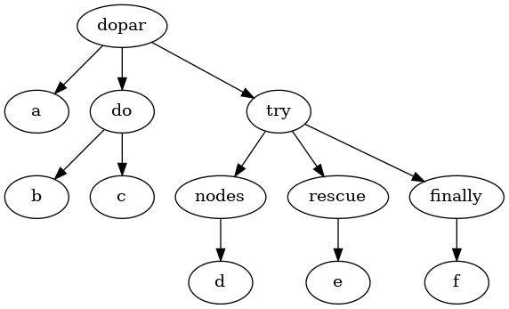

ablauf: long-running workflow management
========================================

[](https://cljdoc.org/d/exoscale/ablauf/CURRENT/api/exoscale.ablauf)
[](https://clojars.org/exoscale/ablauf)

### Wishlist for asynchronous jobs

#### An example language

Most asynchronous workflows rely on basic flow control:

- Ability to execute long running tasks in parallel
- Sequential execution
- Basic rescue mechanism

Resulting ASTs for such programs are extremely limited. Syntax
trees can be modelled with four node types:

- Leaves (actions to be performed)
- Sequential branches (actions in sequence)
- Parallel branches (actions in parallel)
- Try branches (try/rescue/finally triples)

So a simple program like:

```clojure
(dopar!!
  (log!! "a")
  (do!!
    (log!! "b")
	(log!! "c"))
  (try!!
    (log!! "d")
	(rescue!! (log!! "e"))
	(finally!! (log!! "f"))))
```

Would result in the following tree:



This is what `ablauf.ast` provides, with a corresponding spec.

### Job execution

Now that a simplistic but sufficient AST exists, comes the question of its
execution. It would be trivial to walk the above tree and execute things
as they are found. The notion of parallel nodes makes things a bit less
obvious.

Long running workflows bring three additional requirements to the table:

- Execution should be able to restart from a previous known-state
- Workflows might need to execute in different contexts
- Job statuses should be inspectable

The first requirement mandates that jobs should do their best to
provide high availability, the second mandates that workflows should
be decoupled from their execution environment.

#### An abstract job execution library

To fulfill the above requirements, it was assumed that jobs would
either be processed from a manifold-based single-process environment
or from Kafka consumers depending on the job. So can a simple AST's
execution be separated from its execution environment?

The proposed model here takes inspiration from *Continuation Passing Style*
(CPS), but proposes passing the resulting syntax tree instead of a procedure.

Execution of a program results in feeding the result of previously dispatched
actions to a reducer which generates new potential actions to dispatch. This
can be provided with the following signatures

```haskell
make_job    :: AST -> Job
restart_job :: Job -> [Results] -> Job -> [Actions]
```

Here `make_job`, generates a job ready for execution.
`restart_job` given a set of results would yield an updated
job and follow-up actions to take. The namespace in `bundes.job`
provides exactly this functionality for the AST described above.

This was simplified by `clojure.zip`'s zippers, a data structure which
stores a tree and the position in that tree, making walking and
storing AST state that much easier. Gérard Huet wrote a
[paper](https://www.st.cs.uni-saarland.de/edu/seminare/2005/advanced-fp/docs/huet-zipper.pdf)
which inspired `clojure.zip`, a recommended read.

##### Execution on Kafka

With Kafka, this strategy would require a topic per action,
and one for program restarts.

A `restarter` topic receives either new executions or restarts
with results.

With the provided dispatch actions generated, messages would
be sent to per-action topics. Upon execution on the per-action topics,
messages would be sent back to the `restarter` topic.

##### Execution with Manifold

For an in-process, non distributed version manifold provides sufficient
facilities to write a simple fully asynchronous executor. A working
implementation can be found in `ablauf.job.manifold`.

##### Inspecting state

With the proposed approach, given unique IDs for executions, storing
the full execution tree after each restart provides full introspection
into the state of each job.

##### Terminology for job statuses

Some job status can have more than one `true` predicate:

| status | `done?` | `failed?` | `eligible?` | `pending?` | `aborted?` |
|--------|---------|-----------|-------------|------------|------------| 
| `:job/aborted` | Y | Y | N | N | Y |
| `:job/failure` | Y | Y | N | N | N |
| `:job/success` | Y | N | N | N | N |
| `:job/pending` | N | N | Y | Y | N |

### Terminology

#### AST
AST or abstract syntax tree, is the representation of the ablauf program. It can consist of the following nodes:

* `::ast/leaf`: A node without children. Represents an action the program should take.
* `::ast/seq`: Represents a list of actions that will be executed sequentially.
* `::ast/par`: Represents a list of actions that will be executed in parallel.
* `::ast/try`: A node that contains at most 3 children:
    * Forms: An `::ast/seq` containing the actions to be tried
    * Rescue: An `::ast/seq` containing the actions to be executed if the ast in form returns an error
    * Finally: An `::ast/seq` containing actions that will be executed after either forms or rescue completes.

#### Dispatcher
An `::ast/leaf`, which represents an action performed by the program, is defined by the following spec

``` clojure
(defmethod spec-by-ast-type :ast/leaf
  [_]
  (s/keys :req [:ast/action :ast/payload]))


(s/def :ast/action    keyword?)
(s/def :ast/payload   any?)
```

The `::ast/action` is a keyword that represents the action to be performed. A dispatcher matches this keyword to the actual implementation.
By default, the manifold runner uses the `dispatch-action` multimethod to route the action to a function that knows how to handle it, based on the `::ast/action` key. It is possible to supply your own dispatcher implementation using the `:action-fn` key in `manifold/runner`.

#### Runner
The runner is the execution engine that'll schedule and coordinate the actions in the ablauf ast. Since ablauf is based on a continuation passing mechanism, the runner is closely tied to the messaging mechanism. Anything that provides a queue-like abstraction should be usable as the basis for a runner implementation.

At the time of writing the only runner implementation is based around the stream abstraction from the manifold library, which provides an in process queue without durability. This README also contains some pointers for how a runner based on apache Kafka could be made, should more durability be required.

### Future work

#### Conditionals in flow control

Threading a context through operations and providing conditional
execution is a logical next step. It's unclear yet whether it will be
needed but would be easy.

#### Lazy topology lookups

The presented work assumes a static AST, dynamic ASTs would be easy to
add, expanding nodes based on information provided in steps.
#### Trying out

```clojure
(require '[ablauf.job.ast      :as ast]
         '[ablauf.job          :as job]
         '[ablauf.job.store    :as store]
         '[ablauf.job.manifold :refer [runner]])


(def ast
  (ast/dopar!!
    (ast/log!! "a")
    (ast/try!!
      (ast/fail!!)
      (ast/log!! "should-not-run")
      (rescue!!  (ast/log!! "rescue"))
      (finally!! (ast/log!! "finally")))))

(let [db            (atom {})
      store         (store/mem-job-store db)
      [job context] @(runner store ast {})]
  ...
  (job/failed? job) ;;=> false
  (job/done? job)   ;;=> true
  @db)

```

### Caveats

This solution has a few obvious problems:

#### Storage bloat

Storing the full AST tree, including results, for each step will limit
the size of jobs that can be created. It does not seem however that
we will have deep jobs.
